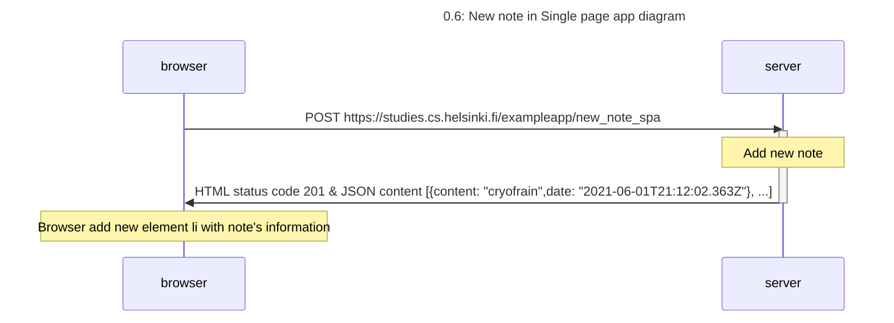

```mermaid
sequenceDiagram
    title 0.6: New note in Single page app diagram
    participant browser
    participant server

    browser->>server: POST https://studies.cs.helsinki.fi/exampleapp/new_note_spa
    activate server
    Note over server: Add new note
    server->>browser: HTML status code 201 & JSON content [{content: "cryofrain",date: "2021-06-01T21:12:02.363Z"}, ...]
    deactivate server
    
    Note over browser: Browser add new element li with note's information
```